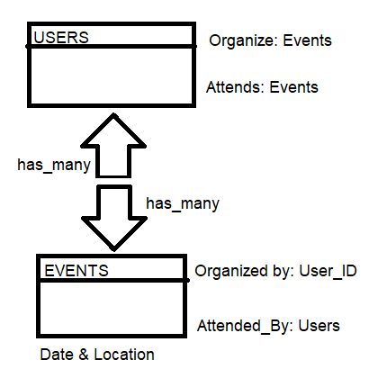

# Project : Private-Events

> The project builds on the previously learnt concepts of Devise Gem & Rails DB properties like belongs_to and has_many.Introducing relationship: many_many, Own Authentication and Attendees tracking

#### Highlight: Users->Attending Multiple Events & Events->Attended by Multiple Users.




### Built With

- Ruby, Ruby on Rails, VS Code Editor
- Active Records
- Devise Gem
- Forms & Helpers
- Rspec, Capybara, Selenium
- Browser: Chrome {change/override in this File, Last Line: ``` spec\rails_helper.rb ```}
### Getting Started
#### Model generated:
- User Authentication
  - Signup
  - Login
- Events
  - View Events
    - Past Events
    - Upcoming Events
  - Attend Events
  - Create New Event
- User Views
  - Hosted Events
  - Past Events
  - Upcoming Events
- User Logout
  - Cannot Attend Events
  - Cannot Create a New Event
### Setup
* To clone this repository, open your Terminal and execute the following command:
``` git clone https://github.com/smy5152/Private-events.git ```
### Run
* Change into the folder
``` cd private-only ```
* Install js dependencies
``` yarn install ```
* Install gems
``` bundle install ```
* Run Database migrations
``` rails db:migrate ```
* Rails Local Server
``` rails server ``` 
* Launch Local App
- Open your browser and type http://localhost:3000

### How to run the test suite


### How To:
* Run Rails console
``` rails console ```
> To start testing the models, execute the following commands from the Rails console.
> We have added some default content in each Model.
- User.all
- Events.all
- Enrollment.all
## Authors
🧑‍💻 **Shabbir**
- GitHub: [@smy5152](https://github.com/smy5152)
- Twitter: [@smy5152](https://twitter.com/smy5152)
- LinkedIn: [Shabbir Yamani](https://www.linkedin.com/in/shabbirmyamani/)

🧑‍💻 **Miguel**
- GitHub: [@meltrust](https://github.com/meltrust)
- Twitter: [@meltrustDVX](https://twitter.com/meltrustDVX)
- LinkedIn: [Miguel(meltrust) Tapia Escalera](https://www.linkedin.com/in/meltrust/)

## 🤝 Contributing
Contributions, issues, and feature requests are welcome!
## Show your support
Give a ⭐️ if you like this project!
## Acknowledgments
- [Micoverse team](https://www.microverse.org/)

## 📝 License
This project is [MIT](LICENSE) licensed.
